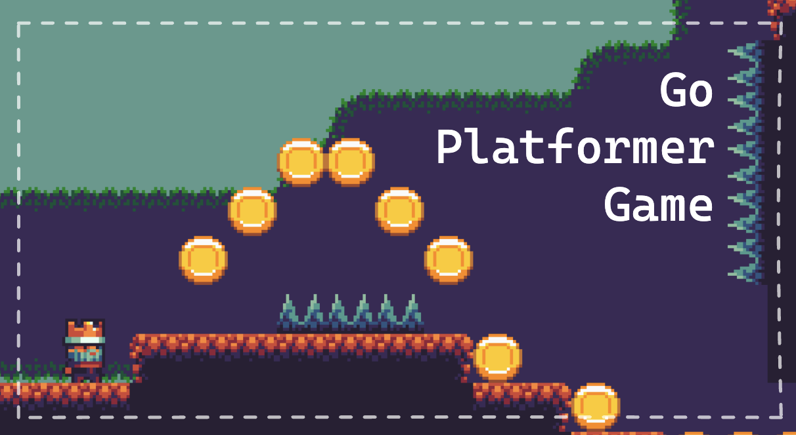
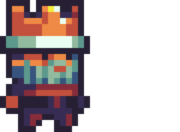
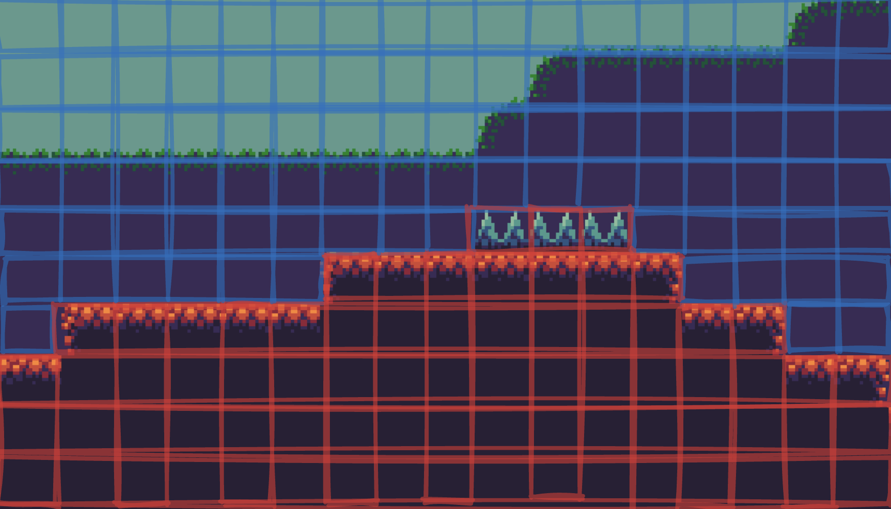
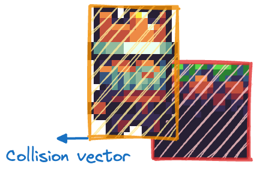
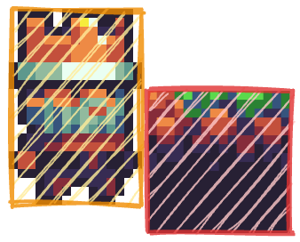
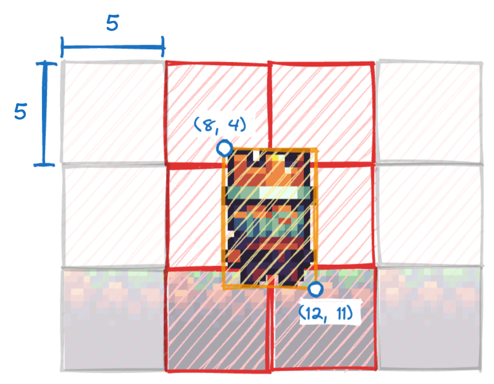
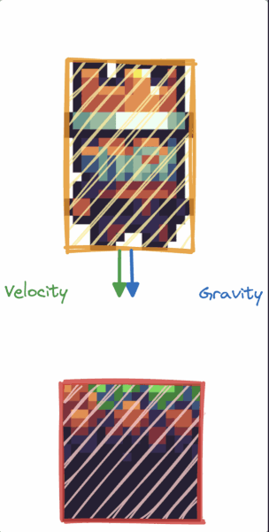
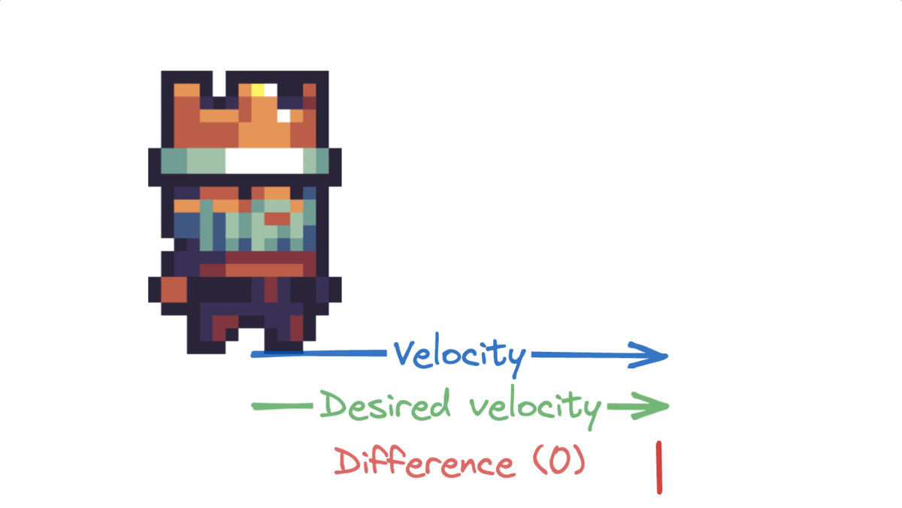
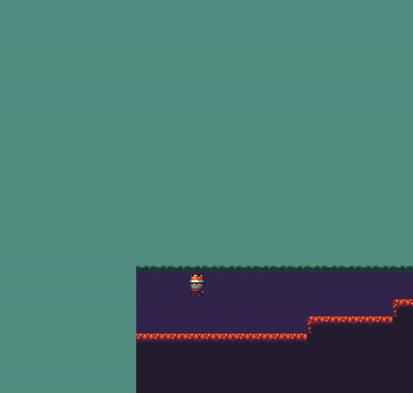
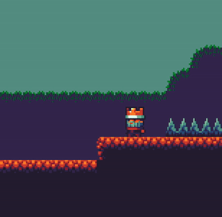

# Golang platformer game

A simple platformer game written in Golang

## Table of Contents

1. [Installation](#installation)
2. [How to play](#how-to-play)
3. [Credits](#credits)
4. [Game Mechanics Explanation](#game-mechanics-explanation)

## Installation

### Prerequisites

MacOS or Windows 10 (Windows 11 should work too, but I haven't tested it)

### Installation

1. Download the latest release from [releases page](https://github.com/kacperkrolak/golang-platformer-game/releases) for your operating system
2. Unzip the file
3. Run the executable (make sure `assets` folder is in the same directory as the executable)

## How to play

### Controls

- `A` or `Left Arrow` - move left
- `D` or `Right Arrow` - move right
- `Space` or `W` or `Up Arrow` - jump

### Performing a wall jump

To perform a wall jump you need to press the jump button while touching and facing the wall.

### Goal

The game doesn't have a well-defined win condition, but you should try to reach the end of the map and collect all coins.

## Credits

- Graphics: [OpenGameArt - Buch](https://opengameart.org/users/buch) and [OpenGameArt - GrafxKid](https://opengameart.org/users/grafxkid)

## Game Mechanics Explanation

> **NOTE**: This text is only in the main README.md file because otherwise, no one would read it. Check [docs directory](./docs) for explanations of different topics.

This document outlines my thought process and design decisions for creating a movement in platformer. It may also serve as a resource for those interested in building a platformer from scratch.

TL;DR If you want to have a good time just use Unity

## Establishing the Basics

Our first step is to create a Player entity. This entity possesses essential attributes such as position, size, and the ability to render a character texture. When the user is pressing the right or left arrow, we will move the Character some number of pixels per frame in the corresponding direction.

&nbsp;

Our map will consist of a grid of equally sized tiles, each either collidable or non-collidable.

Collision system

To prevent the Player from passing through walls we will implement collision detection. After the Character is moved we will iterate through all the files and calculate a collision vector, which determines if the collision is vertical, horizontal, or nonexistent ([0,0]). The player is then teleported to the nearest collision-free position, giving the appearance of seamless movement.

<table border="0">
 <tr>
    <td><b style="font-size:1.5rem">Before</b></td>
    <td><b style="font-size:1.5rem">After</b></td>
 </tr>
 <tr>
    <td></td>
    <td></td>
 </tr>
</table>

> **NOTE**: Since our map is a grid, there are more efficient ways for checking collisions.

  
<i>Explanation of optimized grid collision</i>

    
 I decided to get the player's top left and bottom right corner positions and divide them by tile size. By doing so we get indices of tiles which the characters overlap with, and then we iterate through all of them to check whether they are collidable. There are a few nuances in the implementation, but this method is significantly faster.

  

  <table border="0">
 <tr>
    <td></td>
    <td>
Calculations for this example: 
    min_x = 8/5 = 1 
    min_y = 4/5 = 0 
    max_x = 12/5 = 2 
    max_y = 11/5 = 2 
    So we only need to check tiles with indices (1, 0), (1, 1), (2, 0), (2, 1), (2, 2)
</td>
    
</td>
 </tr>
 </table>
    

</table>

## Movement and gravity

Our character can now move left to right and collide with walls, but it feels rather robotic. They immediately reach max velocity and stop abruptly. Additionally, we can move the player down a few pixels in every frame, but then how can we implement jumping? Should we teleport the player up?

To solve these problems we will simulate physics. Our character will gain two new properties - velocity and acceleration. In each frame, gravity is added to acceleration, and the resulting acceleration is added to velocity. Finally, velocity is added to the position, and acceleration is reset to zero.

To add gravity, we add force facing downwards to the player, to jump we add much stronger upward force. This system provides a more dynamic and natural movement experience.

We've introduced the ability for the player to accelerate horizontally, but it's important to set boundaries on the maximum velocity and enable a smooth stop when no keys are active. Instead of opting for realistic friction, we're taking a different approach.

Firstly, we establish the desired velocity based on user input: `base_speed` (some constant) for a right key press, `-base_speed` for a left key press, and `0` when keys are inactive. Then, we calculate the difference between the desired and current velocities. By multiplying this difference by some fraction and applying a smoothing function, we make the character accelerate more quickly at higher velocities and gradually at lower ones.

<em>Demonstration of deceleration</em>

The last step to implement forces is to add events which will remove the velocity. For example, when the player collides with the ground, we set the vertical velocity to zero, otherwise, the acceleration will keep increasing and eventually, the player will fall through the ground.

<em>What would happen if we didn't stop the player's vertical velocity?</em>

## Improving how the game feels

At this point, we have a working platformer, but it still feels a bit off. The movement is not as smooth as we would like. In this section, we will explore some techniques to improve the feel of the game.

### Coyote time

Coyote time refers to a game design concept where the player is given a brief window of time after they walk off the edge of a platform to execute a jump or other corrective action, even if they appear to be in mid-air. This design choice can be beneficial as it makes the game feel more fair. It reduces the punishment for minor timing errors.

<em>Slight exaggeration of coyote time</em>

### Extend the highest point of the jump

To make the jump feel satisfying we can extend the time at the highest point of the jump. When the player is near the top, we will reduce gravity slightly and increase the horizontal speed. This will make the player feel like they're floating for a brief moment.

### Make the fall faster

When the character is in free fall, players often feel like they don't have much say in what's happening. To make the game more responsive, we can increase the downward speed when the player is falling. This tweak reduces the time when players feel they have limited control over the character, making the game more engaging.

## Conclusion

Platformers may seem simple at first, but there is a lot of complexity behind them. My explanation only scratches the surface of the topic and popular games like Celeste do a lot more to make the game feel responsive and fair.
